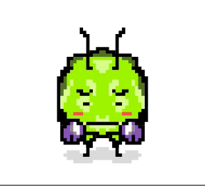

# CS359B Project (Marcella Cindy Prasetio)

Cribtori is a blockchain-based game where users own and can interact with their own decentralized virtual pets. The game has 2 main items, Toris as virtual pets and Accessories as in-game items. Users can interact with each other through trading Toris and items, as well as interaction through their Toris.

<p align="center">
  
</p>

#### Problem Background

Breeding and Trading are two of the common recipe in blockchain gaming. If we only consider these two aspects, there is not much variety of gameplay available in blockchain.

#### Solution
Combining the social aspect of virtual pet games and benefits of blockchain technology to introduce a more interactive gameplay.

All of the Toris and Accessories live in the Blockchain. This includes all transactions involving the tokens, such as breeding, fusion, and trading. Small interactions and actions, such as feeding, cleaning, and room editing, are implemented by a backend server. In the future, Cribtori will integrate the information stored in the Database with Smart Contract interactions.

#### Future Plan 

Cribtori is currenly progressing as a side project for a Main net launch. 

#### Interested in knowing more?

Sign up to our [mailing list] (https://goo.gl/forms/7gIlC2rFhQfyYUEW2) : 

## Features and Functionalities

* Nurture and interact with your Toris.
* Customize your Toris' room with unique Accessories.
* Visit and check out other players' room.
* Level up and unlock more of Toris' abilities and functionalities.
* Breed your Toris with other players'.
* Fuse your Toris togetehr to level up!

### My Tori

Toris are delicate and lovable creature, where each have one of four different personalities. 
Keep them happy by feeding and cleaning them from time to time. Their personalities will affect how much your actions mean to them! Visit your Toris from “My Tori” page.

Feed and clean each of your Tori in the room by clicking on the action buttons and then clicking on your Tori. Don’t forget to do these actions regularly! 

Bored of empty room? Customize your room with Accessories! Place Accessories through “Edit Room” action and create your own unique room. You can also place your Toris anywhere in the room. Remember, you can only interact with Toris currently in your room. 

### Nursery

Ready to make more Toris? Go and visit other players’ Tori, choose which one you like and breed with the Tori! While breeding, your Tori will not be available for fusion, breeding, or selling. Check back again after the breeding timer is done to claim your Tori. You can only breed your Tori with Toris of the same or lesser level.

Have a surplus of Toris? Fuse two of your Toris with the equal level. By fusing, you can create a new Tori with higher level. Higher level Toris have more benefits, such as bigger living space and customizable greetings! BEWARE! Fusing Toris will sacrifice two of your Toris to generate a new one.

### Explore

Visit other players’ Toris and check out each of their own unique Tori and room. 
Other players can visit your Toris too. They can see how happy and how cool your room is! So be sure to take good care of your Tori and room. 

### Marketplace

Check out the marketplace for Accessories and Toris for sale. You can also post your Tori or Accessories for sale!


## FAQ

Q: My Tori looks sad :( How do I make it happy?

A: Feed & Clean! These two actions will increase your Tori’s happiness level.


Q: Why do I need to keep my Tori happy?

A: Other player can visit your room and check out your Toris. Happy Toris make the room more livelier. In a future action, your Tori happiness level will play a big role ;) Better practice from now!


Q: My room looks really boring. Is there a way to liven things up?

A: Yes! Edit your rooms with Accessories through “Edit Room”. Place items and toris by first, selecting an item, and then selecting an empty space in your room. You can remove items by clicking on it again. Just be sure to have at least on Tori and don’t block the entrance!


Q: Where can I get cool Accessories for my room?

A: Check out the Marketplace. Currently, there are 10 unique Accessories available. More to come!


Q: What is the difference between Breeding and Fusion?

A: Breeding can only occur between your Tori and other players’ Tori of the same or lesser level.  Fusion can only be done to two of your Toris of the same level. Breeding will create a new Tori after the breeding period ends, while Fusion will sacrifice two of your Toris to create a higher level Tori.


Q: My room is too small and I have a lot of Toris. Help!

A: You can get a bigger room by levelling up your Toris! Check out the level progress of your Toris in their Details page. Your room size will be determined by the maximum level of your Toris.


Q: How can I get special Toris?

A: We hand out special promo Tori occasionally. Sign up to our mailing list and we’ll keep you up to date!


## Development

### Technologies used

* Solidity - Smart contract programming language
* React - Front end
* Node - Backend
* MySQL - Database

### Requirements

* node.js
* truffle
* ganache

### Installing dependencies
```
npm install
```

### Migrating contracts
```
truffle compile 
truffle migrate --reset
```

### Running the web app for development
```
npm start
```
